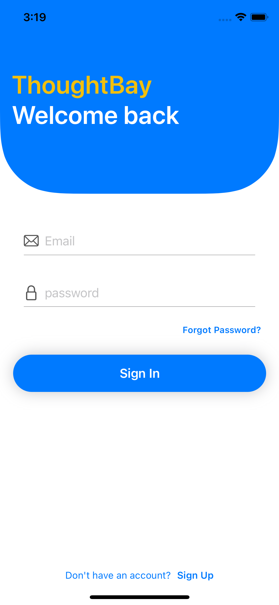

# ThoughtBay

<b>1. Problem Statement</b>

What is the problem you are trying to solve? What is the pain point?

In this fast-growing world of the Internet, it is very much essential for people to stay 
connected and share their thoughts, ideas and their experiences regarding a 
particular topic, incident, food, sports etc. All human beings are social animals and 
networking has become an integral part of our life. The connectedness among 
people gives rise to growth and prosperity. "Alone, we can do so little; together, we 
can do so much" as rightfully said by Helen Keller.

<b>2. Approach</b>

How will you address the problem?

Our approach to this problem is using the latest technologies in existence to make a 
personalized application based on the above problem statement. Through this app, 
people would be able to share their thoughts, and ideas, speak out their minds, 
explore, follow other people and so on. We bring the community closer to people at 
their fingertips.

<b>3. Users of the app</b>

Who are the typical users of your app?

• Users can be anyone who has created an account on the platform and 
provided his/her age is acceptable according to the standards set by the 
government or any recognized organization. 
• Everyone is free to share their ideas, thoughts, and experiences on this 
platform provided he/she has an account.

<b>4. Who is your competitor?</b>

What is the value addition in your app?

• Social Media Apps like Twitter and Facebook are the competitors for our app. 
• Ad-free experience and minimalist design make our app stand out. 
• Simple User Interface so that it is easily accessible to all age groups.

<b>5. Features</b>

• All the Users are Authenticated and have to create an account. (Sign in/Up) 
• Users can like/unlike and reply to other people's posts. 
• Users can create a new Post and share it with the Community. 
• Each user has a Profile Page which consists of the posts made by a user, his 
replies to other users' posts and the posts liked by him/her. 
• Each user has a side menu consisting of his followers, following users count 
and other options such as log in/out, and profile. 
• All the posts are stored in a database. (Firebase).

<b>6. Screens</b>

 
<table style="border:1px solid;">
  <tr >
    <th style="text-align: center; border:1px solid;">Login Page</th>
    <th style="text-align: center; border:1px solid;">SignUp Page</th>
  </tr>
  <tr >
    <td style="text-align: center; border:1px solid;padding:1em;">
        
    </td>
    <td style="text-align: center; border:1px solid;padding:1em;">
         
    </td>
  </tr>
  
</table>
 
<table style="border:1px solid;">
  <tr >
    <th style="text-align: center; border:1px solid;">Profile Photo Upload</th>
    <th style="text-align: center; border:1px solid;">Profile Photo Upload</th>
  </tr>
  <tr >
    <td style="text-align: center; border:1px solid;padding:1em;">
        
    </td>
    <td style="text-align: center; border:1px solid;padding:1em;">
         
    </td>
  </tr>
  
</table>
 
<table style="border:1px solid;">
  <tr >
    <th style="text-align: center; border:1px solid;">Home Page</th>
    <th style="text-align: center; border:1px solid;">Explore Page</th>
  </tr>
  <tr >
    <td style="text-align: center; border:1px solid;padding:1em;">
        
    </td>
    <td style="text-align: center; border:1px solid;padding:1em;">
         
    </td>
  </tr>
  
</table>
 
<table style="border:1px solid;">
  <tr >
    <th style="text-align: center; border:1px solid;">Side Menu Page</th>
    <th style="text-align: center; border:1px solid;">Post Upload Page</th>
  </tr>
  <tr >
    <td style="text-align: center; border:1px solid;padding:1em;">
        
    </td>
    <td style="text-align: center; border:1px solid;padding:1em;">
         
    </td>
  </tr>
  
</table>
 
<table style="border:1px solid;">
  <tr >
    <th style="text-align: center; border:1px solid;">Profile Page</th>
    <th style="text-align: center; border:1px solid;">Profile Page</th>
    <th style="text-align: center; border:1px solid;">Profile Page</th>
  </tr>
  <tr >
    <td style="text-align: center; border:1px solid;padding:1em;">
        
    </td>
    <td style="text-align: center; border:1px solid;padding:1em;">
         
    </td>
    <td style="text-align: center; border:1px solid;padding:1em;">
         
    </td>
  </tr>
  
</table>

